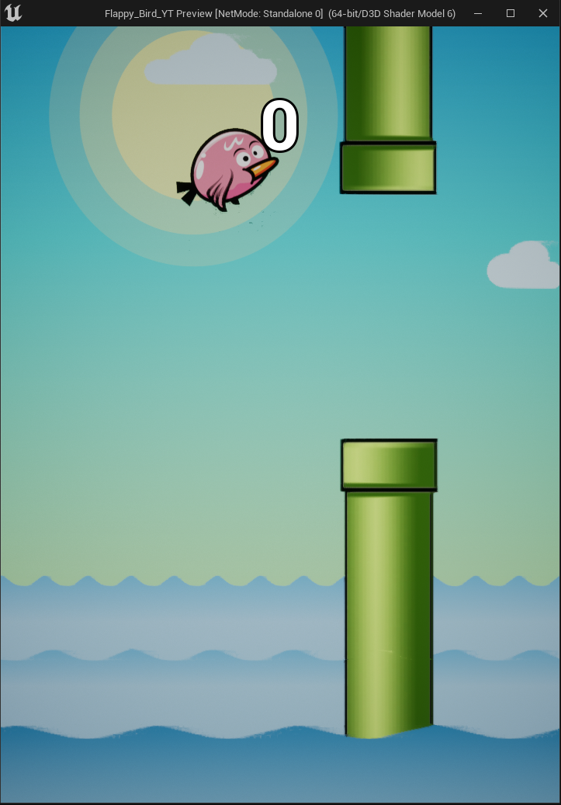
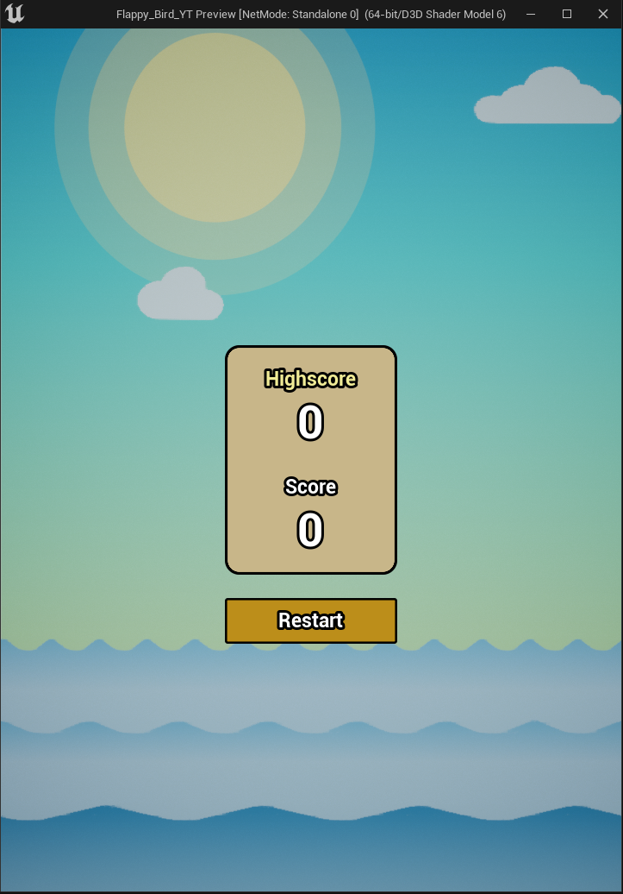

# 🐦 Flappy Bird UE

Un clone arcade / endless runner sviluppato in Unreal Engine. Il progetto implementa un gameplay loop minimale basato su input discreti e gestione fisica semplificata, focalizzandosi su performance, reattività dell'input e modularità.

## 📦 Technologies

- Unreal Engine
- C++ / Blueprints
- Git & GitHub

## 🦄 Features

Ecco cosa puoi fare in Flappy Bird UE:

- **Arcade Gameplay:** Controlla il player tramite un singolo input per il salto con gravità costante applicata.
- **Procedural Obstacles:** Affronta ostacoli generati dinamicamente con difficoltà incrementale basata su velocità e spaziatura.
- **Score System:** Incrementa il punteggio in tempo reale e sfrutta la persistenza dell'high score.
- **State Management:** Sfrutta una FSM (Finite State Machine) semplificata per la gestione degli stati di gioco (Start, Running, Game Over).

## 🚢 The Process

Ho iniziato configurando il **Player Controller** per gestire l'input dell'utente e l'applicazione della forza verticale in tempo reale. 

Successivamente, ho sviluppato il **Game Loop Manager** per controllare lo stato della partita e coordinare la transizione tra le fasi di start, esecuzione e game over.

Per la parte visiva e di gameplay, ho implementato l'**Obstacle System** per lo spawning procedurale dei tubi e il **Collision System** basato su bounding volumes per gestire accuratamente gli impatti.

Infine, ho separato la logica dal rendering e aggiunto la persistenza dell'high score per garantire un'esperienza fluida e stabile.

## 💡 What I Learned

Durante lo sviluppo di questo progetto ho approfondito diversi aspetti chiave dello sviluppo in Unreal Engine:

- **Realtime Game Loop:** Gestione efficiente del ciclo di vita del gioco e della fisica di base.
- **Modular Design:** Struttura del codice e dei componenti in modo indipendente e riutilizzabile.
- **State Machines:** Implementazione di logiche di controllo centralizzate per gestire i flussi di gioco.

## 🚦 Running the Project

Per eseguire il progetto nel tuo ambiente locale, segui questi passaggi:

1. Clona la repository sul tuo computer.
2. Apri la cartella del progetto utilizzando **Unreal Engine**.
3. Avvia la simulazione direttamente nell'editor o genera una build standalone per Windows.

## 🎬 Video / Previews

